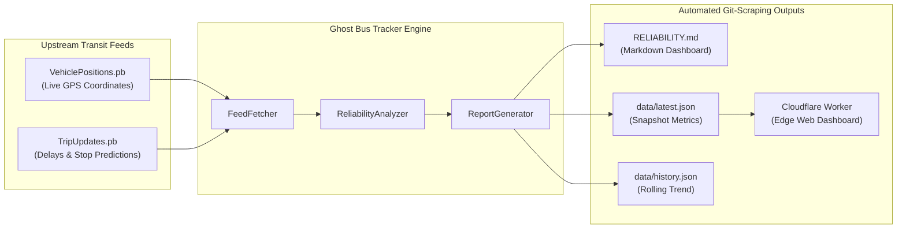

# 🚌 Ghost Bus Tracker

[](https://github.com/aminamos/ghost-bus-tracker/actions/workflows/ci.yml)
[](https://github.com/aminamos/ghost-bus-tracker/actions/workflows/track.yml)
[](https://www.python.org/)
[](LICENSE)
[](https://ghost-bus-tracker.a-8c6.workers.dev)

Automated public transit reliability, schedule adherence, and **ghost bus** tracking engine for **Metro Transit**, the primary transit operator serving the **Minneapolis–Saint Paul ("Twin Cities") seven-county metropolitan area in Minnesota, USA**. Built on GTFS and GTFS Realtime (GTFS-RT) Protocol Buffer feeds.

- **Transit Agency:** [Metro Transit](https://www.metrotransit.org) (Metropolitan Council)
- **Service Location:** Minneapolis & Saint Paul, Minnesota, USA (Hennepin, Ramsey, Anoka, Carver, Dakota, Scott & Washington counties)
- **Transit Network:** Urban & suburban bus routes, METRO Light Rail (Blue & Green lines), and METRO Bus Rapid Transit (A, C, D, Orange & Red lines)
- **Live web dashboard:** **[ghost-bus-tracker.a-8c6.workers.dev](https://ghost-bus-tracker.a-8c6.workers.dev)**  
- **Auto-updating Markdown report:** **[`RELIABILITY.md`](RELIABILITY.md)**  
- **Data snapshots:** **[`data/latest.json`](data/latest.json)** & **[`data/history.json`](data/history.json)**

---

## Table of Contents

- [What is a "Ghost Bus"?](#what-is-a-ghost-bus)
- [Methodology & Metrics Calculation](#methodology--metrics-calculation)
  - [Core Metrics](#core-metrics)
- [Architecture & Git-Scraping](#architecture--git-scraping)
- [Quick Start & CLI Usage](#quick-start--cli-usage)
  - [Prerequisites](#prerequisites)
  - [Installation](#installation)
  - [CLI Commands](#cli-commands)
    - [1. Scan Transit Feeds](#1-scan-transit-feeds)
    - [2. View Terminal Scorecard Summary](#2-view-terminal-scorecard-summary)
    - [3. Re-render Markdown Dashboard](#3-re-render-markdown-dashboard)
- [Running Tests](#running-tests)
- [Multi-City & Agency Presets](#multi-city--agency-presets)
- [Cloudflare Workers Deployment](#cloudflare-workers-deployment)
  - [API Endpoints](#api-endpoints)
- [Repository Structure](#repository-structure)
- [License](#license)

---

<a id="what-is-a-ghost-bus"></a>
## 👻 What is a "Ghost Bus"?

In urban public transit, a **Ghost Bus** is a scheduled run that transit apps and countdown arrival boards tell riders is coming, but which never actually arrives. Commuters wait in the elements only to watch the arrival time count down to "Due" or "Now" and then vanish from the board into thin air.

Ghost buses occur primarily due to:
1. **Unassigned Runs (Phantom Schedules)**: The transit agency's trip scheduling system publishes an active run in the feed, but dispatch had no physical bus or driver available, so no vehicle transponder was ever assigned.
2. **Unannounced Cancellations**: Operators or dispatch cancel scheduled runs without pushing a cancellation update in a timely manner.
3. **GPS Transponder Broadcast Drops**: A vehicle is operating, but hardware, radio dead zones, or system sync failures drop the vehicle's telemetry from the real-time position feed.

---

<a id="methodology--metrics-calculation"></a>
<a id="methodology-metrics-calculation"></a>
## 📐 Methodology & Metrics Calculation

Ghost Bus Tracker correlates **GTFS-RT Vehicle Positions** (`vehiclepositions.pb`) with **GTFS-RT Trip Updates** (`tripupdates.pb`) across sliding transit service windows:



### Core Metrics

1. **Ghost Bus Rate ($\%$)**:
   $$\text{Ghost Bus Rate} = \left( \frac{N_{\text{ghost}}}{N_{\text{scheduled}}} \right) \times 100\%$$
   Where a trip is flagged as ghost if:
   - Schedule relationship is explicitly marked `CANCELED`, OR
   - Trip is scheduled without any assigned vehicle transponder AND has no active GPS broadcast, OR
   - Assigned vehicle ID is missing from active GPS transponder broadcasts.

2. **On-Time Adherence ($\%$)**:
   Transit industry standard threshold:
   $$\text{On-Time} \iff -60\text{s} \le \text{Departure Delay} \le +300\text{s} \quad (-1\text{m to }+5\text{m})$$
   $$\text{On-Time Rate} = \left( \frac{N_{\text{on-time}}}{N_{\text{tracked with delay data}}} \right) \times 100\%$$

3. **Early Departure Warning ($< -60\text{s}$)**:
   Vehicles leaving stops more than 1 minute ahead of schedule. (Early departures are critical service defects because passengers arrive on time only to find their bus has already left.)

4. **Excess Wait Time (EWT) & Headway Regularity**:
   Quantifies additional passenger waiting time caused by vehicle bunching and irregular spacing beyond the scheduled headway:
   $$\text{Average Wait Time} = \frac{\sum H_i^2}{2 \sum H_i}$$
   $$\text{EWT} = \text{Observed Average Wait Time} - \text{Scheduled Average Wait Time}$$

---

<a id="architecture--git-scraping"></a>
<a id="architecture-git-scraping"></a>
## ⚡ Architecture & Git-Scraping

This repository uses **Git-Scraping** (Simon Willison pattern) powered by GitHub Actions:

- **Cron Schedule (`*/30 * * * *`)**: A GitHub Action runs every 30 minutes.
- **Ingestion**: Ingests binary Protocol Buffer feeds directly from Twin Cities Metro Transit (or any GTFS-RT compliant agency).
- **Processing**: The Python engine parses entities, classifies trips, runs statistical aggregations, and computes route rankings.
- **Commit & Push**: If new reliability data differs from the last run, Git commits the new `data/latest.json`, appends to `data/history.json`, and updates `RELIABILITY.md`.
- **Git as a Database**: Every commit represents an immutable time-series data point of transit reliability history.

---

<a id="quick-start--cli-usage"></a>
<a id="quick-start-cli-usage"></a>
## 🚀 Quick Start & CLI Usage

### Prerequisites
- Python 3.10+ (or [uv](https://github.com/astral-sh/uv))

### Installation
Clone the repository:
```bash
git clone https://github.com/aminamos/ghost-bus-tracker.git
cd ghost-bus-tracker
```

Using `uv` (recommended):
```bash
uv sync
```

Or using standard `pip`:
```bash
python -m venv .venv
source .venv/bin/activate  # On Windows: .venv\Scripts\activate
pip install -r requirements.txt
```

### CLI Commands

#### 1. Scan Transit Feeds
Fetch live GTFS-RT feeds, analyze reliability, and save results:
```bash
# Live scan with automatic fallback to sample data if offline
python -m src.cli scan --live --save --report

# Scan using bundled sample/offline feed
python -m src.cli scan --sample --save --report

# Custom feed URLs
python -m src.cli scan --vp-feed https://my-transit.org/vehicles.pb --tu-feed https://my-transit.org/trips.pb --save
```

#### 2. View Terminal Scorecard Summary
```bash
python -m src.cli summary
```
Example Output:
```text
============================================================
 [BUS] GHOST BUS TRACKER: METRO TRANSIT (TWIN CITIES)
 Scan Time: 2026-09-14T00:35:23.071428+00:00
============================================================
 Scheduled Trips:    477
 Active GPS Fleet:   412
 Confirmed Ghosts:   65
 Ghost Bus Rate:     13.63%
 On-Time Adherence:  73.3%
 Mean Delay:         +242.2s (4.0m)
------------------------------------------------------------
 Delay Breakdown:
   On-Time (-1m..+5m): 302
   Early (>1m early):  7
   Minor (+5m..+15m):  69
   Severe (>15m late): 34
   Ghost / Missing:    65
------------------------------------------------------------
 Top Worst Routes by Ghost Rate:
   Route 11    | Ghost Rate:  61.5% (8/13 trips) | Avg Delay: +240.0s
   Route 921   | Ghost Rate:  50.0% (10/20 trips) | Avg Delay: +0.5s
   Route 540   | Ghost Rate:  42.9% (3/7 trips) | Avg Delay: +139.8s
   Route 18    | Ghost Rate:  33.3% (8/24 trips) | Avg Delay: +304.3s
   Route 64    | Ghost Rate:  33.3% (4/12 trips) | Avg Delay: +114.8s
============================================================
```

#### 3. Re-render Markdown Dashboard
```bash
python -m src.cli report --input data/latest.json --output RELIABILITY.md
```

---

<a id="running-tests"></a>
## 🧪 Running Tests

The test suite runs with `pytest` and `pytest-cov`, providing 97%+ code coverage:

```bash
uv run pytest tests/ --cov=src --cov-report=term-missing
```

---

<a id="multi-city--agency-presets"></a>
<a id="multi-city-agency-presets"></a>
## 🏙️ Multi-City & Agency Presets

While the live dashboard at [ghost-bus-tracker.a-8c6.workers.dev](https://ghost-bus-tracker.a-8c6.workers.dev) defaults to **Minneapolis–Saint Paul (Metro Transit)**, Ghost Bus Tracker is a universal engine built on standard GTFS-RT Protocol Buffers. It includes built-in presets for other major cities:

| City / Region | Agency | Preset ID | Access / Auth | Network |
| :--- | :--- | :--- | :--- | :--- |
| **Minneapolis–St. Paul, MN** | Metro Transit | `twin-cities` | Open (No key) | Bus, METRO Light Rail & BRT |
| **Chicago, IL** | CTA | `chicago` / `cta` | Free API Key | 'L' Trains & Bus Fleet |
| **Boston, MA** | MBTA | `boston` / `mbta` | Open (No key) | Subway, Light Rail & Bus |
| **New York, NY** | MTA | `nyc` / `mta` | Free API Key | NYC Subway & Regional Bus |

> 💡 **Chicago & The Origin of "Ghost Buses":** The term "Ghost Bus" was famously coined and popularized in Chicago by transit advocacy groups (such as Commuters Take Action) investigating severe phantom bus schedules across the Chicago Transit Authority (CTA).

### CLI Usage for Other Cities

List all built-in presets:
```bash
python -m src.cli presets
```

Scan Boston (MBTA - completely open):
```bash
python -m src.cli scan --preset boston
```

Scan Chicago (CTA - with developer key from [transitchicago.com/developers](https://www.transitchicago.com/developers/)):
```bash
# Pass key via flag or export CTA_API_KEY
python -m src.cli scan --preset chicago --api-key <YOUR_CTA_KEY>
```

Scan any custom transit agency anywhere in the world:
```bash
python -m src.cli scan \
  --vp-feed https://my-city-transit.org/gtfs-rt/vehicles.pb \
  --tu-feed https://my-city-transit.org/gtfs-rt/trips.pb \
  --agency "My City Transit" \
  --city "Seattle, WA"
```

---

<a id="cloudflare-workers-deployment"></a>
## ☁️ Cloudflare Workers Deployment

The project includes an edge-hosted interactive web dashboard inside `worker/`:

```bash
cd worker
npx wrangler dev       # Local preview
npx wrangler deploy    # Deploy to Cloudflare Workers edge
```

Live Worker URL: [https://ghost-bus-tracker.a-8c6.workers.dev](https://ghost-bus-tracker.a-8c6.workers.dev)

### API Endpoints
- `GET /`: Interactive web dashboard
- `GET /api/latest`: Latest JSON reliability snapshot
- `GET /api/history`: Historical time-series reliability log
- `GET /api/summary`: Scorecard KPI object
- `GET /api/routes`: Upstream Metro Transit route proxy
- `GET /health`: Worker healthcheck

---

<a id="repository-structure"></a>
## 📁 Repository Structure

```text
ghost-bus-tracker/
├── .github/
│   └── workflows/
│       ├── track.yml           # Git-scraping cron workflow (runs every 30m)
│       └── ci.yml              # Multi-python version CI test suite
├── data/
│   ├── latest.json             # Latest reliability snapshot
│   └── history.json            # Rolling historical reliability trend
├── sample_data/
│   ├── vehiclepositions_sample.pb   # Real GTFS-RT binary vehicle snapshot
│   └── tripupdates_sample.pb        # Real GTFS-RT binary trip update snapshot
├── src/
│   ├── __init__.py
│   ├── config.py               # Config parameters, URLs, and thresholds
│   ├── models.py               # Pydantic data models
│   ├── fetcher.py              # Protobuf & REST HTTP feed ingest engine
│   ├── analyzer.py             # Ghost bus, delay, and headway analysis logic
│   ├── reporter.py             # Markdown and JSON report generator
│   └── cli.py                  # Command-line interface
├── tests/
│   ├── __init__.py
│   ├── conftest.py             # Pytest fixtures and mock protobuf generators
│   ├── test_fetcher.py         # Feed download and protobuf parsing tests
│   ├── test_analyzer.py        # Ghost bus calculation and edge case tests
│   ├── test_reporter.py        # Report and JSON export tests
│   ├── test_cli.py             # CLI command verification tests
│   └── test_coverage_edge_cases.py  # Branch coverage tests
├── worker/
│   ├── package.json
│   ├── wrangler.jsonc          # Cloudflare Worker configuration
│   └── src/
│       ├── index.js            # Worker edge handler and HTML dashboard
│       └── snapshot_data.js    # Bundled snapshot data
├── pyproject.toml
├── requirements.txt
├── RELIABILITY.md              # Auto-updating reliability dashboard
├── README.md
├── LICENSE                     # MIT License
└── .gitignore
```

---

<a id="license"></a>
## 📄 License

This project is open source and available under the [MIT License](LICENSE).
