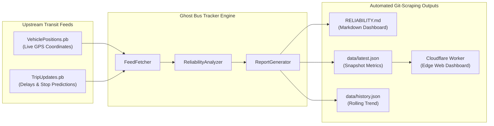

# 🚌 Ghost Bus Tracker

[](https://github.com/aminamos/ghost-bus-tracker/actions/workflows/ci.yml)
[](https://github.com/aminamos/ghost-bus-tracker/actions/workflows/track.yml)
[](https://www.python.org/)
[](LICENSE)
[](https://ghost-bus-tracker.a-8c6.workers.dev)

Automated public transit reliability, schedule adherence, and **ghost bus** tracking engine for **Metro Transit**, the primary transit operator serving the **Minneapolis–Saint Paul ("Twin Cities") seven-county metropolitan area in Minnesota, USA**. Built on GTFS and GTFS Realtime (GTFS-RT) Protocol Buffer feeds.

- **Transit Agency:** [Metro Transit](https://www.metrotransit.org) (Metropolitan Council)
- **Service Location:** Minneapolis & Saint Paul, Minnesota, USA (Hennepin, Ramsey, Anoka, Carver, Dakota, Scott & Washington counties)
- **Transit Network:** Urban & suburban bus routes, METRO Light Rail (Blue & Green lines), and METRO Bus Rapid Transit (A, C, D, Orange & Red lines)
- **Live web dashboard:** **[ghost-bus-tracker.a-8c6.workers.dev](https://ghost-bus-tracker.a-8c6.workers.dev)**  
- **Auto-updating Markdown report:** **[`RELIABILITY.md`](RELIABILITY.md)**  
- **Data snapshots:** **[`data/latest.json`](data/latest.json)** & **[`data/history.json`](data/history.json)**

---

## Table of Contents

- [What is a "Ghost Bus"?](#what-is-a-ghost-bus)
- [Methodology & Metrics Calculation](#methodology--metrics-calculation)
  - [Core Metrics](#core-metrics)
- [Architecture & Git-Scraping](#architecture--git-scraping)
- [Quick Start & CLI Usage](#quick-start--cli-usage)
  - [Prerequisites](#prerequisites)
  - [Installation](#installation)
  - [CLI Commands](#cli-commands)
    - [1. Scan Transit Feeds](#1-scan-transit-feeds)
    - [2. View Terminal Scorecard Summary](#2-view-terminal-scorecard-summary)
    - [3. Re-render Markdown Dashboard](#3-re-render-markdown-dashboard)
- [Running Tests](#running-tests)
- [Multi-City & Agency Presets](#multi-city--agency-presets)
- [Cloudflare Workers Deployment](#cloudflare-workers-deployment)
  - [API Endpoints](#api-endpoints)
- [Repository Structure](#repository-structure)
- [License](#license)

---

<a id="what-is-a-ghost-bus"></a>
## 👻 What is a "Ghost Bus"?

In urban public transit, a **Ghost Bus** is a scheduled run that transit apps and countdown arrival boards tell riders is coming, but which never actually arrives. Commuters wait in the elements only to watch the arrival time count down to "Due" or "Now" and then vanish from the board into thin air.

Ghost buses occur primarily due to:
1. **Unassigned Runs (Phantom Schedules)**: The transit agency's trip scheduling system publishes an active run in the feed, but dispatch had no physical bus or driver available, so no vehicle transponder was ever assigned.
2. **Unannounced Cancellations**: Operators or dispatch cancel scheduled runs without pushing a cancellation update in a timely manner.
3. **GPS Transponder Broadcast Drops**: A vehicle is operating, but hardware, radio dead zones, or system sync failures drop the vehicle's telemetry from the real-time position feed.

---

<a id="methodology--metrics-calculation"></a>
<a id="methodology-metrics-calculation"></a>
## 📐 Methodology & Metrics Calculation

Ghost Bus Tracker correlates **GTFS-RT Vehicle Positions** (`vehiclepositions.pb`) with **GTFS-RT Trip Updates** (`tripupdates.pb`) across sliding transit service windows:


```mermaid
flowchart LR
    subgraph Upstream ["Upstream Transit Feeds"]
        VP["VehiclePositions.pb<br/>(Live GPS Coordinates)"]
        TU["TripUpdates.pb<br/>(Delays & Stop Predictions)"]
    end

    subgraph Engine ["Ghost Bus Tracker Engine"]
        Fetcher["FeedFetcher"]
        Analyzer["ReliabilityAnalyzer"]
        Reporter["ReportGenerator"]
    end

    subgraph Outputs ["Automated Git-Scraping Outputs"]
        ReportMD["RELIABILITY.md<br/>(Markdown Dashboard)"]
        LatestJSON["data/latest.json<br/>(Snapshot Metrics)"]
        HistoryJSON["data/history.json<br/>(Rolling Trend)"]
        CFWorker["Cloudflare Worker<br/>(Edge Web Dashboard)"]
    end

    VP --> Fetcher
    TU --> Fetcher
    Fetcher --> Analyzer
    Analyzer --> Reporter
    Reporter --> ReportMD
    Reporter --> LatestJSON
    Reporter --> HistoryJSON
    LatestJSON --> CFWorker
```

### Core Metrics

1. **Ghost Bus Rate ($\%$)**:
   $$\text{Ghost Bus Rate} = \left( \frac{N_{\text{ghost}}}{N_{\text{scheduled}}} \right) \times 100\%$$
   Where a trip is flagged as ghost if:
   - Trip is scheduled without any assigned vehicle transponder AND has no active GPS broadcast, OR
   - Assigned vehicle ID is missing from active GPS transponder broadcasts, OR
   - Assigned vehicle is broadcasting off-schedule with no vehicle covering the trip.
   Trips explicitly marked `CANCELED` are their own bucket: NOT ghosts, NOT tracked, and excluded from delay stats.

2. **On-Time Adherence ($\%$)**:
   Transit industry standard threshold:
   $$\text{On-Time} \iff -60\text{s} \le \text{Departure Delay} \le +300\text{s} \quad (-1\text{m to }+5\text{m})$$
   $$\text{On-Time Rate} = \left( \frac{N_{\text{on-time}}}{N_{\text{tracked with delay data}}} \right) \times 100\%$$

3. **Early Departure Warning ($< -60\text{s}$)**:
   Vehicles leaving stops more than 1 minute ahead of schedule. (Early departures are critical service defects because passengers arrive on time only to find their bus has already left.)

4. **Excess Wait Time (EWT) & Headway Regularity**:
   Quantifies additional passenger waiting time caused by vehicle bunching and irregular spacing beyond the scheduled headway:
   $$\text{Average Wait Time} = \frac{\sum H_i^2}{2 \sum H_i}$$
   $$\text{EWT} = \text{Observed Average Wait Time} - \text{Scheduled Average Wait Time}$$
   Approximation notes: headways are computed per route *and direction* from scheduled start times. A uniform delay shifts every departure equally and cannot change headway, so observed headway equals scheduled headway here; EWT is estimated from delay variance (delay jitter is what produces bunching), not from measured departures.

---

<a id="architecture--git-scraping"></a>
<a id="architecture-git-scraping"></a>
## ⚡ Architecture & Git-Scraping

This repository uses **Git-Scraping** (Simon Willison pattern) powered by GitHub Actions:

- **Cron Schedule (`*/30 * * * *`)**: A GitHub Action runs every 30 minutes.
- **Ingestion**: Ingests binary Protocol Buffer feeds directly from Twin Cities Metro Transit (or any GTFS-RT compliant agency).
- **Processing**: The Python engine parses entities, classifies trips, runs statistical aggregations, and computes route rankings.
- **Commit & Push**: If new reliability data differs from the last run, Git commits the new `data/latest.json`, appends to `data/history.json`, and updates `RELIABILITY.md`.
- **Git as a Database**: Every commit represents an immutable time-series data point of transit reliability history.

---

<a id="quick-start--cli-usage"></a>
<a id="quick-start-cli-usage"></a>
## 🚀 Quick Start & CLI Usage

### Prerequisites
- Python 3.10+ (or [uv](https://github.com/astral-sh/uv))

### Installation
Clone the repository:
```bash
git clone https://github.com/aminamos/ghost-bus-tracker.git
cd ghost-bus-tracker
```

Using `uv` (recommended):
```bash
uv sync
```

Or using standard `pip`:
```bash
python -m venv .venv
source .venv/bin/activate  # On Windows: .venv\Scripts\activate
pip install -r requirements.txt
```

### CLI Commands

#### 1. Scan Transit Feeds
Fetch live GTFS-RT feeds, analyze reliability, and save results:
```bash
# Live scan (fails loudly if the network is unreachable)
python -m src.cli scan --live --save --report

# Live scan with fallback to sample data if offline (opt-in)
python -m src.cli scan --live --save --report --fallback-sample

# Scan using bundled Twin Cities sample/offline feed
python -m src.cli scan --sample --save --report

# Custom feed URLs
python -m src.cli scan --vp-feed https://my-transit.org/vehicles.pb --tu-feed https://my-transit.org/trips.pb --save
```

Notes:
- `--live` is the default when `--sample` is absent; passing both is an error.
- `--fallback-sample` is off by default, so a failed live fetch fails loudly instead of silently swapping in sample data.
- `--preset X --sample` keeps Twin Cities labels with `source="sample"`, because the bundle only holds Twin Cities feeds. Pass `--vp-feed`/`--tu-feed` for real city data.
- API keys are never logged: feed URLs are redacted in log output.

#### 2. View Terminal Scorecard Summary
```bash
python -m src.cli summary
```
Example Output (`scan --sample`, captured 2026-10-05):
```text
============================================================
 [BUS] GHOST BUS TRACKER: METRO TRANSIT (TWIN CITIES)
 Transit System:    Metro Transit
 Location:          Minneapolis–Saint Paul, MN
 Scan Time:         2026-10-05T11:41:39.134102+00:00
 Source:            SAMPLE (offline bundle)
============================================================
 Scheduled Trips:    477
 Active GPS Fleet:   412
 Confirmed Ghosts:   64
 Ghost Bus Rate:     13.42%
 On-Time Adherence:  55.58%
 Mean Delay:         +342.9s (+5.7m)
------------------------------------------------------------
 Delay Breakdown:
   On-Time (-1m..+5m): 229
   Early (>1m early):  24
   Minor (+5m..+15m):  117
   Severe (>15m late):  42
   Ghost / Missing:    64
------------------------------------------------------------
 Top Worst Routes by Ghost Rate:
   Route 11    | Ghost Rate:  53.9% (7/13 trips) | Avg Delay: +339.6s
   Route 921   | Ghost Rate:  50.0% (10/20 trips) | Avg Delay: +97.7s
   Route 540   | Ghost Rate:  42.9% (3/7 trips) | Avg Delay: +138.0s
   Route 18    | Ghost Rate:  33.3% (8/24 trips) | Avg Delay: +443.6s
   Route 64    | Ghost Rate:  33.3% (4/12 trips) | Avg Delay: +300.0s
============================================================
```

#### 3. Re-render Markdown Dashboard
```bash
python -m src.cli report --input data/latest.json --output RELIABILITY.md
```

---

<a id="running-tests"></a>
## 🧪 Running Tests

The test suite runs with `pytest` and `pytest-cov`, providing 97%+ code coverage:

```bash
uv run pytest tests/ --cov=src --cov-report=term-missing
```

---

<a id="multi-city--agency-presets"></a>
<a id="multi-city-agency-presets"></a>
## 🏙️ Multi-City & Agency Presets

While the live dashboard at [ghost-bus-tracker.a-8c6.workers.dev](https://ghost-bus-tracker.a-8c6.workers.dev) defaults to **Minneapolis–Saint Paul (Metro Transit)**, Ghost Bus Tracker is a universal engine built on standard GTFS-RT Protocol Buffers. It includes built-in presets for other major cities:

| City / Region | Agency | Preset ID | Access / Auth | Network |
| :--- | :--- | :--- | :--- | :--- |
| **Minneapolis–St. Paul, MN** | Metro Transit | `twin-cities` / `mpls` | Open (No key) | Bus, METRO Light Rail & BRT |
| **San Francisco, CA** | SFMTA (Muni) | `sf` / `sfmta` / `muni` | Free API Key | Muni Metro, Historic Streetcars, Cable Cars & Buses |
| **Chicago, IL** | CTA | `chicago` / `cta` | Free API Key | 'L' Trains & Bus Fleet |
| **Boston, MA** | MBTA | `boston` / `mbta` | Open (No key) | Subway, Light Rail & Bus |
| **New York, NY** | MTA | `nyc` / `mta` | Free API Key | NYC Subway & Regional Bus |
| **Philadelphia, PA** | SEPTA | `philly` / `septa` | Open (No key) | Subway, Trolley & 120+ Bus Routes |
| **Washington, DC** | WMATA | `dc` / `wmata` | Free API Key | Metrorail & Metrobus Network |
| **Los Angeles, CA** | LA Metro | `la` / `lametro` | Free API Key (Swiftly) | Bus & Metro Rail via Swiftly GTFS-RT |
| **Seattle, WA** | Sound Transit & KCM | `seattle` / `kcm` | Open (No key) | Link Light Rail, Sounder & Buses |
| **Denver, CO** | RTD | `denver` / `rtd` | Open (No key) | Commuter Rail, Light Rail & Bus Grid |
| **Portland, OR** | TriMet | `portland` / `trimet` | Free API Key | MAX Light Rail, Streetcar & Bus Network |
| **Atlanta, GA** | MARTA | `atlanta` / `marta` | Open (No key) | Heavy Rail (4 lines) & Bus Transit |
| **Toronto, ON** | TTC | `toronto` / `ttc` | Open (No key) | Subway (Lines 1-4), Streetcars & Buses |

> 💡 **Interactive Location Switching in the Dashboard:**
> On the live web dashboard at [ghost-bus-tracker.a-8c6.workers.dev](https://ghost-bus-tracker.a-8c6.workers.dev), you can click any transit market chip (e.g. switching between Minneapolis, San Francisco, Chicago, Boston, New York, Philadelphia, D.C., Los Angeles, Seattle, Denver, Portland, Atlanta, or Toronto) to immediately update all KPIs, charts, worst routes, and feed diagnostics. You can also deep-link directly via URL parameter: `?city=philly`, `?city=la`, `?city=dc`, `?city=sf`, `?city=mpls`, etc.

> 💡 **Chicago & The Origin of "Ghost Buses":** The term "Ghost Bus" was famously coined and popularized in Chicago by transit advocacy groups (such as Commuters Take Action) investigating severe phantom bus schedules across the Chicago Transit Authority (CTA).

### CLI Usage for Other Cities

List all built-in presets:
```bash
python -m src.cli presets
```

Inspect a preset-fed scan offline (labels stay Twin Cities with `source="sample"`):
```bash
python -m src.cli scan --preset sf --sample
```

Scan Boston (MBTA - completely open):
```bash
python -m src.cli scan --preset boston
```

Scan Chicago (CTA - apply for a key at [transitchicago.com/developers/bustracker](https://www.transitchicago.com/developers/bustracker/) or [traintrackerapply](https://www.transitchicago.com/developers/traintrackerapply/); keys arrive by email, historically 1-2 weeks. Note 2026-10-05: both key types validate on their native APIs but the GTFS-RT protobuf endpoints reject both with `errCd 101`, so Chicago stays on its static snapshot until CTA grants GTFS-RT access):
```bash
# Pass key via flag or export CTA_API_KEY
python -m src.cli scan --preset chicago --api-key <YOUR_CTA_KEY>
```

> The cron pipeline scans every market: open feeds always, keyed feeds when their key is configured. Until a market's first live scan lands, the dashboard shows its bundled static snapshot.

### Scanning every city

```bash
# All 13 presets: writes data/latest/<id>.json, data/history/<id>.json, RELIABILITY-<id>.md
python -m src.cli scan-all

# Subset only
python -m src.cli scan-all --presets boston,philly,seattle
```

Six agencies need free API keys; without any key `scan-all` skips the city with a warning:

| Agency | Env var | Register |
| :--- | :--- | :--- |
| Chicago CTA | `CTA_API_KEY` | transitchicago.com/developers/bustracker (emailed key) |
| NYC MTA | `MTA_API_KEY` | api.mta.info |
| SF SFMTA | `BAY_AREA_511_KEY` | 511.org/open-data/token |
| DC WMATA | `WMATA_API_KEY` | developer.wmata.com |
| Portland TriMet | `TRIMET_APP_ID` | developer.trimet.org |
| LA Metro | `LAMETRO_API_KEY` | goswift.ly/realtime-api-key |

Same key for similar endpoints: a preset's VP and TU feeds share the preset's own key. Across providers, sharing is group-scoped only: presets marked `key_group: socrata` fall back to `SOCRATA_API_KEY` (one Socrata/Tyler Tech token works across all of their portals). Agency variables and `--api-key` still win when set. No current preset is Socrata-backed.

The cron workflow passes these through from GitHub Actions secrets of the same names. The other seven markets scan with no key (Seattle's OneBusAway endpoints don't enforce their documented key).

Scan any custom transit agency anywhere in the world:
```bash
python -m src.cli scan \
  --vp-feed https://my-city-transit.org/gtfs-rt/vehicles.pb \
  --tu-feed https://my-city-transit.org/gtfs-rt/trips.pb \
  --agency "My City Transit" \
  --city "Seattle, WA"
```

---

<a id="cloudflare-workers-deployment"></a>
## ☁️ Cloudflare Workers Deployment

The project includes an edge-hosted interactive web dashboard inside `worker/`:

```bash
cd worker
npx wrangler dev       # Local preview
npx wrangler deploy    # Deploy to Cloudflare Workers edge
```

Live Worker URL: [https://ghost-bus-tracker.a-8c6.workers.dev](https://ghost-bus-tracker.a-8c6.workers.dev)

### API Endpoints
- `GET /`: Interactive multi-market web dashboard with Global Feeds Explorer and an All Markets overview table (text filter plus multi-select, `?cities=` deep-link)
- `GET /api/latest`: Latest JSON reliability snapshot (supports `?city=<preset>`; includes `stale`/`live` flags)
- `GET /api/history`: Full all-time per-market series served from D1 (falls back to `data/history.json`); static snapshots for markets with no scan yet
- `GET /api/summary`: Scorecard KPI object (supports `?city=<preset>`; includes `stale`/`live` flags)
- `GET /api/markets`: List of all 13 supported transit markets and aliases
- `GET /api/catalog`: Curated sample of the MobilityDatabase catalog (full catalog holds 990+ feeds; supports `?q=<search>`, `?country=<country>`, `?limit=<n>`)
- `GET /api/live/vp` and `GET /api/live/tu`: Live GTFS-RT protobuf proxy. Defaults follow `?city=<preset>`; an explicit `?url=` must be `https:` on an allowlisted agency feed host, otherwise the proxy returns 400.
- `GET /api/routes`: Upstream Metro Transit route proxy (Twin Cities only; other `?city=` values return 400)
- `GET /health`: Worker healthcheck
Unknown `?city=` values return 404 on `/api/*` endpoints (the HTML dashboard still defaults to Twin Cities). Until a market's first live scan lands, the dashboard shows its bundled static snapshot.

Durability: every scan appends to uncapped per-market `data/history/<id>.json` (git-versioned), upserts into the D1 `scans` table (all-time, keyed by market and time), and archives versioned JSON snapshots to the R2 `ghost-bus-snapshots` bucket under `snapshots/<id>/<scan-time>.json` plus a `latest.json` pointer.

---

<a id="repository-structure"></a>
## 📁 Repository Structure

```text
ghost-bus-tracker/
├── .github/
│   └── workflows/
│       ├── track.yml           # Git-scraping cron workflow (runs every 30m)
│       └── ci.yml              # Multi-python version CI test suite
├── data/
│   ├── latest.json             # Latest Twin Cities snapshot (legacy path)
│   ├── history.json            # Twin Cities history (legacy path, uncapped)
│   ├── latest/<id>.json        # Per-market latest snapshot (scan-all)
│   └── history/<id>.json       # Per-market full history (scan-all)
├── sample_data/
│   ├── vehiclepositions_sample.pb   # Real GTFS-RT binary vehicle snapshot
│   └── tripupdates_sample.pb        # Real GTFS-RT binary trip update snapshot
├── src/
│   ├── __init__.py
│   ├── config.py               # Config parameters, URLs, and thresholds
│   ├── models.py               # Pydantic data models
│   ├── fetcher.py              # Protobuf & REST HTTP feed ingest engine
│   ├── analyzer.py             # Ghost bus, delay, and headway analysis logic
│   ├── reporter.py             # Markdown and JSON report generator
│   └── cli.py                  # Command-line interface
├── tests/
│   ├── __init__.py
│   ├── conftest.py             # Pytest fixtures and mock protobuf generators
│   ├── test_fetcher.py         # Feed download and protobuf parsing tests
│   ├── test_analyzer.py        # Ghost bus calculation and edge case tests
│   ├── test_reporter.py        # Report and JSON export tests
│   ├── test_cli.py             # CLI command verification tests
│   └── test_coverage_edge_cases.py  # Branch coverage tests
├── worker/
│   ├── package.json
│   ├── wrangler.jsonc          # Cloudflare Worker configuration (D1 binding)
│   ├── schema.sql              # D1 scans table: all-time per-market history
│   └── src/
│       ├── index.js            # Worker edge handler and HTML dashboard
│       ├── cities_data.js      # Per-market bundles, presets, feed allowlist
│       ├── mobility_catalog.js # Curated MobilityDatabase sample
│       └── snapshot_data.js    # Bundled Twin Cities fallback snapshot
├── pyproject.toml
├── requirements.txt
├── RELIABILITY.md              # Auto-updating reliability dashboard
├── README.md
├── LICENSE                     # MIT License
└── .gitignore
```

---

<a id="license"></a>
## 📄 License

This project is open source and available under the [MIT License](LICENSE).
